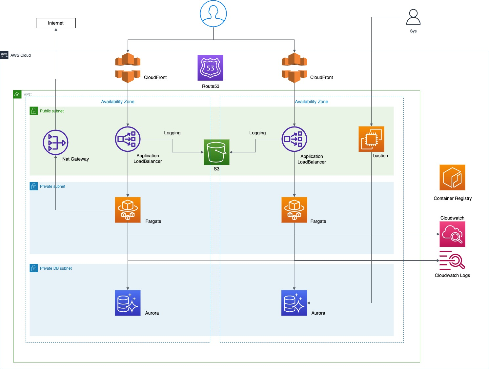

# terraform template

## overview



## usage

- write credentials in a `~/.aws/credentials` file.

```sh
[account]
aws_access_key_id     = anaccesskey
aws_secret_access_key = asecretkey
```

- exec the following command

```bash
cd {development|staging}
terraform init
terraform plan
terraform apply

# If update needed
terraform init -upgrade
```
